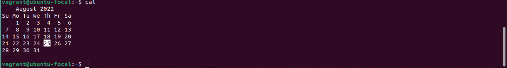
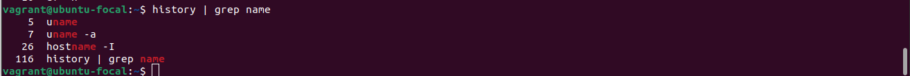
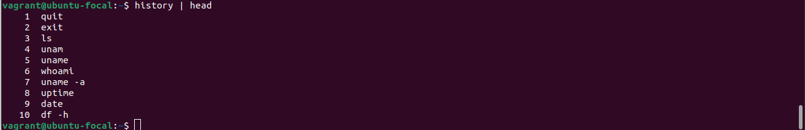
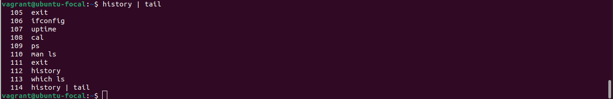
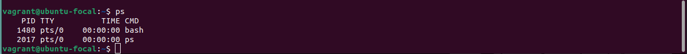
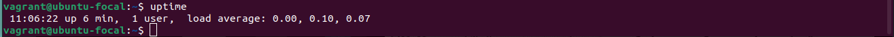
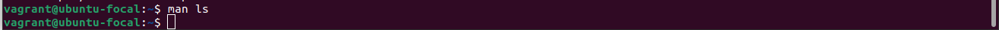
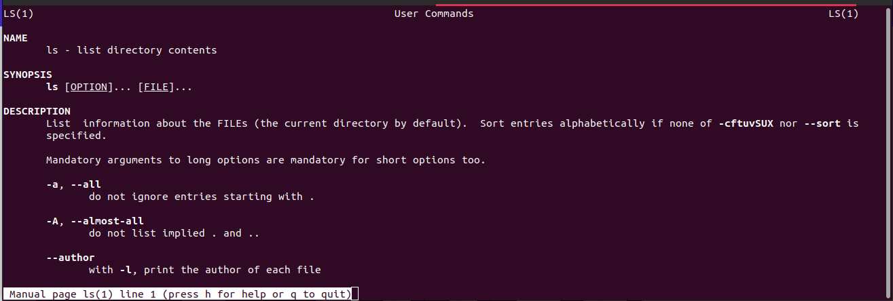
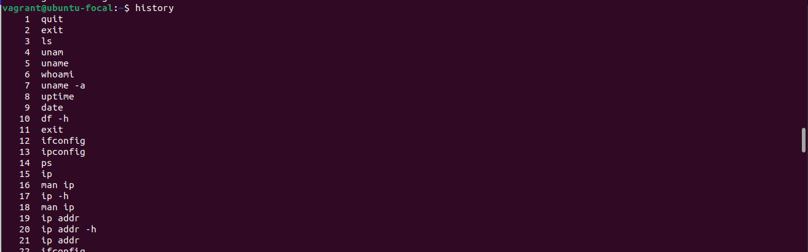
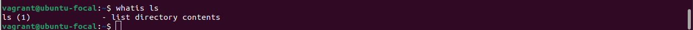

## 10 linux commands and their outputs

### cal
The `cal` command shows the current month and highlights the day by default 

### exit
The `exit` command logs the current user out of the current shell session  

### grep
The `grep` command is used to filter lines of text based on the text pattern given 

### head
The `head` command prints out the first 10 lines of a file or a piped output by default 

### tail
The `tail` command prints out the last 10 lines of a file or a piped output by default 

### ps
The `ps` command prints out the current running processes by default 

### uptime
The `uptime` command prints out how long this current shell session has been up for 

### man
The `man` command prints out the manual on a particular command 

### history
The `history` command prints out a list of all previous commands that have been run 

### whatis
The `whatis` command prints a one line description of a command 
