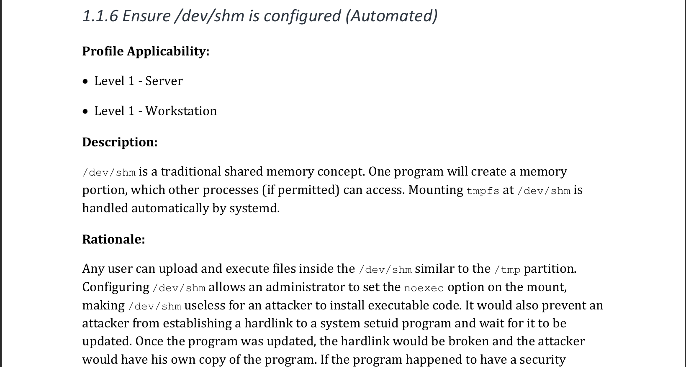
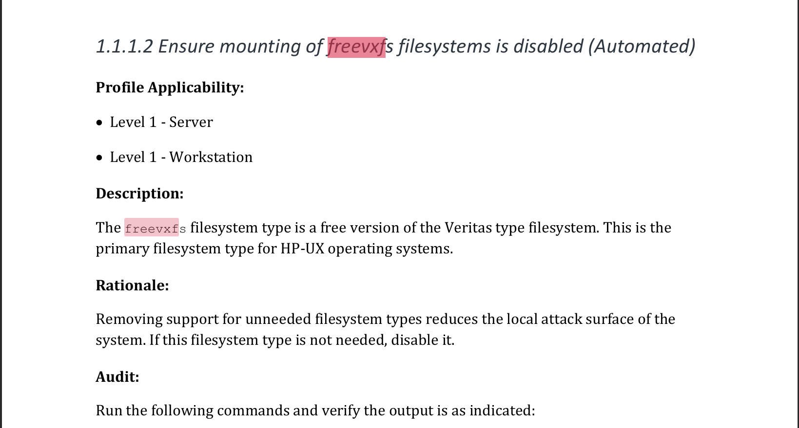
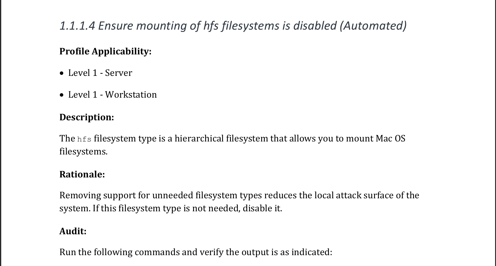
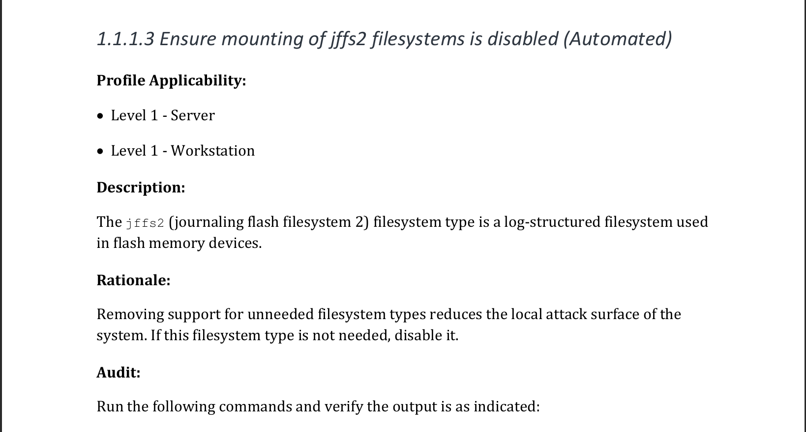

# Exercise 7

- Review the CIS benchmark for ubuntu, and try to implement at least 10 of the recommendations that were made within the benchmark.

### Recommendation 1

.png)

### Recommendation 2

.png)

### Recommendation 3

.png)

### Recommendation 4

.png)

### Recommendation 5

.png)

### Recommendation 6

