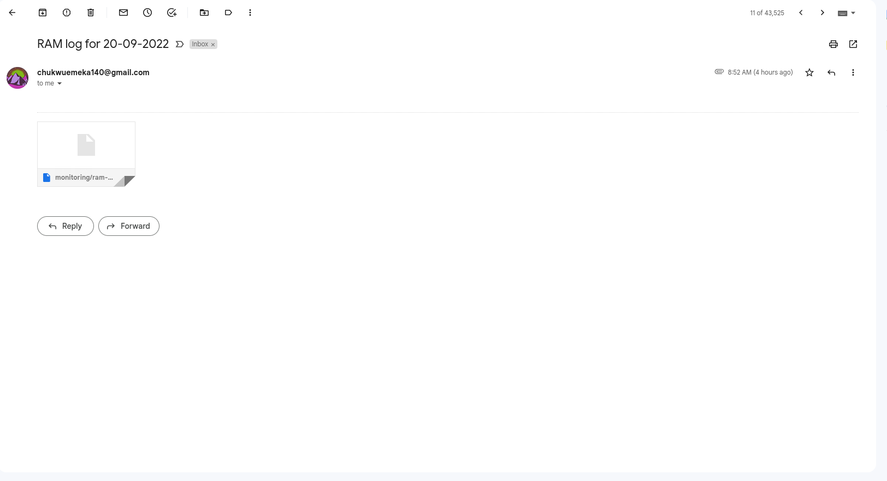

# Exercise 8

- Create a bash script to run at every hour, saving system memory (RAM) usage to a specified file and at midnight it sends the content of the file to a specified email address, then starts over for the new day.

<br>

> **Instruction:**
>
> - Submit the content of your script, cronjob and a sample of the email sent, all in the folder for this exercise.

<br><br>

---

<br>

### Script for monitoring and logging RAM usage on my VM instance
<br>

filepath &emsp; `~/logger`
```bash
#!/usr/bin/env bash
# variables
file_name="ram-monitor-$(date "+%d-%m").log"
curr_time=$(date "+%H:%M")
file_path=~/monitoring/
full_path=$file_path$file_name
day=$(($(date "+%d") - 1))

#check if file exists
if ! [[ -e $file_path ]]; then
	mkdir "$file_path"
fi
if ! [[ -e $file_name ]]; then
	touch "$full_path"
fi

# update file content
{ date; free -h; } >> "$full_path"
echo "--------------------" >> "$full_path"

# send mail at midnight
if [[ $curr_time == "00:00" ]]; then
	echo "" | mail -s "Here's your midnight report for $day-$(date "+%m-%y")." -A "$full_path" chukwuemeka140@gmail.com
fi
```

### Content of the crontab, showing the cronjob to run the logger script

```bash
# Edit this file to introduce tasks to be run by cron.
# 
# Each task to run has to be defined through a single line
# indicating with different fields when the task will be run
# and what command to run for the task
# 
# To define the time you can provide concrete values for
# minute (m), hour (h), day of month (dom), month (mon),
# and day of week (dow) or use '*' in these fields (for 'any').
# 
# Notice that tasks will be started based on the cron's system
# daemon's notion of time and timezones.
# 
# Output of the crontab jobs (including errors) is sent through
# email to the user the crontab file belongs to (unless redirected).
# 
# For example, you can run a backup of all your user accounts
# at 5 a.m every week with:
# 0 5 * * 1 tar -zcf /var/backups/home.tgz /home/
# 
# For more information see the manual pages of crontab(5) and cron(8)
# 
# m h  dom mon dow   command

0 */1 * * * ./logger
```
<br>

Here's a screenshot for the mail sent by the cron job. I accidentally disconnected from the interent before midnight, so the mail wasn't sent as expected. So I had to tweak the time, so the cron job sends the mail.

<br>




Also, here's a copy of the log file itself. [Here! ](./assets/monitoring_ram-monitor-20-09.log) :point_left: